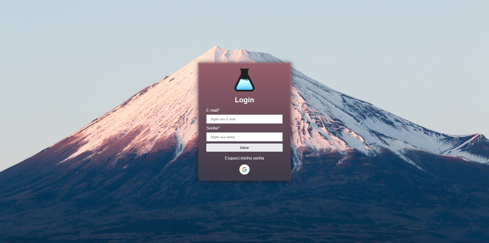

# LOGIN OAUTH GOOGLE


Esse foi um desafio proposto pela comunidade de programação __[Lab Zone](https://www.labzone.com.br)__, onde o projeto consistia em criar uma tela de login simples, porém contendo como obrigatoriedade consumir a api do [Google Oauth](https://developers.google.com/identity/gsi/web/guides/overview). 



### __Requisitos proposto na criação do projeto:__
- O projeto deverá ter como forma de login utilizando o Google;
- No mínimo 2 inputs para inserir dados;
- Após login, o usuário deverá ser levado para uma página de perfil mostrando os dados capturados pela api.


### **Experiências adquiridas**
- Aprendendo a consumir api externa;
- Descobrindo uma nova forma de login para projetos;
- Reforçando as habilidades com javascript e __locationStorage__.

### Como rodar o projeto
Primeiro você deverá criar um projeto, e adquirir seu _Google Client Id_ pela plataforma da [Google](https://console.developers.google.com/).

Leia os passos descritos na documentação. [Documentação](https://developers.google.com/identity/gsi/web/guides/overview)

E insira-o na variável no arquivo google.js (javascript/google.js)
```js  
client_id: "YOUR_GOOGLE_CLIENT_ID"
```

```cmd
$ git clone https://github.com/PequenoJoohn/login-google-oauth.git
$ cd login-google-oauth
$ yarn or npm install
$ yarn css //Run to scss compiler, generate css folder
```


Após estes passos, abra o index.html no seu navegador.

#### Have for fun :)

<!-- <h1 align="center">

OldModz95

</h1> -->

<br>
<br>

<p style="text-align:center; font-size: 24px">Faça parte da comunidade</p>

<a href="https://discord.gg/bZdNzScxMz" target="_blank" alt="logo" style="display: flex; justify-content: center"> 
    
</a>